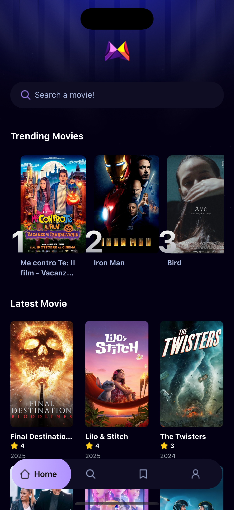
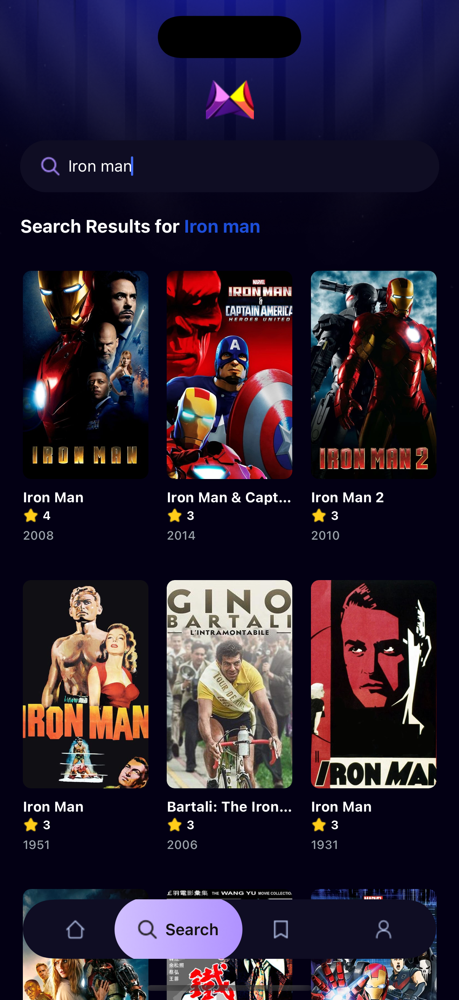
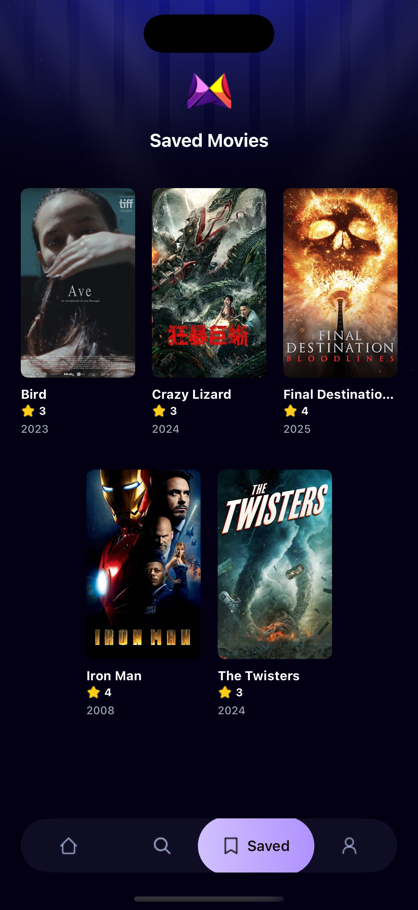
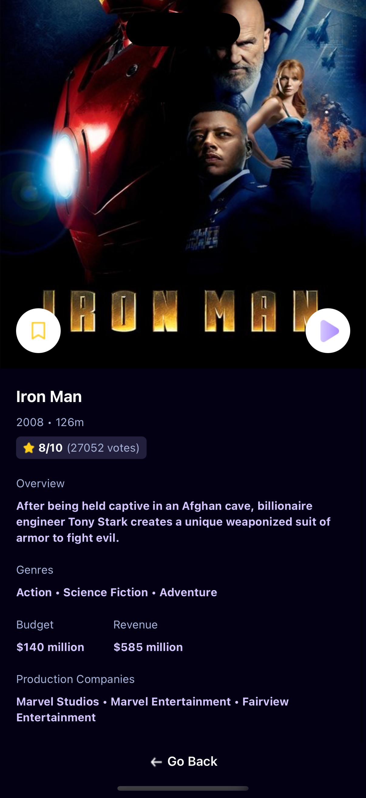
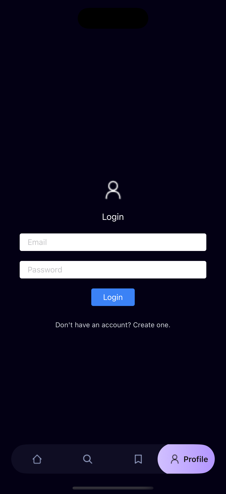

# Movie Mobile App 🎬📱

A sleek and modern mobile app for discovering and searching movies with real-time trending insights.

## 🚀 Features

- 🎞️ **Movie Discovery:** Browse the latest movies using the TMDB API.
- 🔍 **Search Functionality:** Search movies by name with responsive query handling.
- 💾 **Save Movies:** Save your favorite movies locally using AsyncStorage.
- 🧠 **Trending Algorithm:** Tracks and ranks search terms based on frequency using Appwrite.
- 👤 **Authentication:** Create or login to your profile.
- 📺 **Watch Trailers:** Watch movie trailers via embedded YouTube players.
- 🧱 **Built with React Native (bare workflow)**
- 🌙 **Styled with Tailwind (nativewind)** for a modern UI.

## 🛠️ Technologies

- React Native
- TypeScript
- Appwrite (Database + Document API)
- TMDB API
- NativeWind (Tailwind CSS)
- AsyncStorage
- Expo Router
- React Native YouTube Iframe

## 📂 Project Structure

```
/app
  /(tabs)
    _layout.tsx       # Bottom tab layout
    index.tsx         # Home screen
    search.tsx        # Search screen
    saved.tsx         # Saved movies screen
    profile.tsx       # Login / Create account
    movies/[id].tsx   # Movie detail + trailer
/assets
/components
/constants
/services
```

## ⚙️ Getting Started

1. **Clone the repository:**
   ```bash
   git clone https://github.com/your-username/movie-mobile-app.git
   cd movie-mobile-app
   ```

2. **Install dependencies:**
   ```bash
   npm install
   ```

3. **Setup environment variables:**
   Create a `.env` file in the root directory with the following:
   ```
   EXPO_PUBLIC_APPWRITE_PROJECT_ID=your_project_id
   EXPO_PUBLIC_APPWRITE_DATABASE_ID=your_database_id
   EXPO_PUBLIC_APPWRITE_COLLECTION_ID=your_collection_id
   EXPO_PUBLIC_MOVIE_API_KEY=your_tmdb_key
   ```

4. **Run the project:**
   ```bash
   npx expo start
   ```

## 📸 Screenshots

| Home | Search | Saved |
|------|--------|-------|
|  |  |  |

| Movie Card | Movie Trailer | Profile |
|-----------|---------------|---------|
|  |  |  |

## 🤝 Contributing

Pull requests are welcome. For major changes, please open an issue first to discuss what you would like to change.
